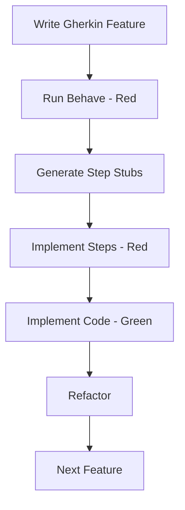

# Advanced Usage Guide

This document covers advanced integration patterns, automation strategies, and workflow optimizations for the `generate-step-stubs` skill.

## Table of Contents

1. [BDD Workflow Integration](#bdd-workflow-integration)
2. [CI/CD Integration](#cicd-integration)
3. [Pre-commit Hooks](#pre-commit-hooks)
4. [Programmatic Usage](#programmatic-usage)
5. [Multi-Project Strategies](#multi-project-strategies)
6. [Performance Optimization](#performance-optimization)
7. [Custom Workflows](#custom-workflows)

---

## BDD Workflow Integration

### Red-Green-Refactor Cycle

Integrate stub generation into the BDD development cycle:



#### Detailed Workflow

**Step 1: Write Feature**
```bash
# Create new feature file
vim features/user_registration.feature
```

**Step 2: Run Behave (Red Phase)**
```bash
behave features/user_registration.feature
# Output: Many undefined steps
```

**Step 3: Generate Stubs**
```bash
python skills/generate-step-stubs/scripts/generate_stubs.py \
    features/user_registration.feature \
    --check-existing features/steps/ \
    -o features/steps/registration_steps.py
```

**Step 4: Run Behave Again (Still Red)**
```bash
behave features/user_registration.feature
# Output: Steps found but NotImplementedError raised
```

**Step 5: Implement Step Logic**
Edit `features/steps/registration_steps.py` and replace `NotImplementedError`.

**Step 6: Run Behave (Green Phase)**
```bash
behave features/user_registration.feature
# Output: All tests pass
```

**Step 7: Refactor**
Clean up implementation while keeping tests green.

---

### Organizing Step Definitions

#### Strategy 1: One File Per Feature

```bash
# Generate separate files for each feature
python generate_stubs.py features/login.feature -o features/steps/login_steps.py
python generate_stubs.py features/logout.feature -o features/steps/logout_steps.py
python generate_stubs.py features/profile.feature -o features/steps/profile_steps.py
```

**Pros:**
- Clear organization
- Easy to find steps
- Reduced merge conflicts

**Cons:**
- Potential duplication across files
- More files to manage

---

#### Strategy 2: By Domain/Layer

```bash
# Group by application layer
python generate_stubs.py features/auth/*.feature -o features/steps/auth_steps.py
python generate_stubs.py features/api/*.feature -o features/steps/api_steps.py
python generate_stubs.py features/ui/*.feature -o features/steps/ui_steps.py

# Group by domain concept
python generate_stubs.py features/*user*.feature -o features/steps/user_steps.py
python generate_stubs.py features/*product*.feature -o features/steps/product_steps.py
```

**Pros:**
- Logical grouping
- Reusable domain steps
- Clearer dependencies

**Cons:**
- Requires planning
- May need reorganization as project grows

---

#### Strategy 3: Common + Feature-Specific

```bash
# Generate common steps (reused across features)
python generate_stubs.py \
    features/login.feature \
    features/logout.feature \
    features/profile.feature \
    --check-existing features/steps/ \
    -o features/steps/auth_common_steps.py

# Then extract truly common steps manually to:
# features/steps/common_steps.py

# Feature-specific steps in separate files
python generate_stubs.py features/admin.feature -o features/steps/admin_steps.py
```

**Pros:**
- Maximum reuse
- Clear separation of concerns
- Easier to maintain

**Cons:**
- Requires manual curation
- Initial setup overhead

---

## CI/CD Integration

### GitHub Actions

Create `.github/workflows/bdd-steps-check.yml`:

```yaml
name: BDD Step Coverage Check

on:
  push:
    branches: [ main, develop ]
    paths:
      - 'features/**/*.feature'
  pull_request:
    branches: [ main ]
    paths:
      - 'features/**/*.feature'

jobs:
  check-step-definitions:
    runs-on: ubuntu-latest

    steps:
      - name: Checkout code
        uses: actions/checkout@v4

      - name: Set up Python
        uses: actions/setup-python@v5
        with:
          python-version: '3.12'

      - name: Install dependencies
        run: |
          pip install behave

      - name: Check for undefined steps
        run: |
          behave features/ --dry-run --no-summary || true

      - name: Generate expected step stubs
        run: |
          python skills/generate-step-stubs/scripts/generate_stubs.py \
            features/*.feature \
            --check-existing features/steps/ \
            --stdout > expected_steps.py

      - name: Check if new steps needed
        run: |
          if [ -s expected_steps.py ]; then
            echo "⚠️  New step definitions may be needed"
            echo "Run: python generate_stubs.py features/*.feature --check-existing features/steps/"
            exit 0  # Warning only, don't fail build
          else
            echo "✓ All steps have definitions"
          fi

      - name: Run BDD tests
        run: |
          behave features/ --tags=@smoke --format=progress
```

---

### GitLab CI

Create `.gitlab-ci.yml`:

```yaml
stages:
  - validate
  - test

validate-bdd-steps:
  stage: validate
  image: python:3.12
  script:
    - pip install behave
    - behave features/ --dry-run --format=json --outfile=behave-results.json || true
    - |
      python skills/generate-step-stubs/scripts/generate_stubs.py \
        features/*.feature \
        --check-existing features/steps/ \
        --stdout > expected_steps.py
    - |
      if [ -s expected_steps.py ]; then
        echo "⚠️  Warning: New step definitions may be needed"
      fi
  artifacts:
    paths:
      - behave-results.json
      - expected_steps.py
    expire_in: 1 week
  only:
    changes:
      - features/**/*.feature

bdd-tests:
  stage: test
  image: python:3.12
  dependencies:
    - validate-bdd-steps
  script:
    - pip install -r requirements.txt
    - behave features/ --tags=@passing --format=progress
  coverage: '/TOTAL.*\s+(\d+%)$/'
```

---

### Jenkins Pipeline

Create `Jenkinsfile`:

```groovy
pipeline {
    agent any

    stages {
        stage('Setup') {
            steps {
                sh 'python -m venv venv'
                sh '. venv/bin/activate && pip install behave'
            }
        }

        stage('Check Step Definitions') {
            when {
                changeset "features/**/*.feature"
            }
            steps {
                script {
                    def result = sh(
                        script: '''
                            . venv/bin/activate
                            python skills/generate-step-stubs/scripts/generate_stubs.py \
                                features/*.feature \
                                --check-existing features/steps/ \
                                --stdout | wc -l
                        ''',
                        returnStdout: true
                    ).trim()

                    if (result.toInteger() > 50) {
                        echo "⚠️  Warning: ${result} lines of new step definitions may be needed"
                    }
                }
            }
        }

        stage('Run BDD Tests') {
            steps {
                sh '. venv/bin/activate && behave features/ --format=json --outfile=behave-results.json'
            }
            post {
                always {
                    archiveArtifacts artifacts: 'behave-results.json', allowEmptyArchive: true
                }
            }
        }
    }
}
```

---

## Pre-commit Hooks

### Using pre-commit Framework

Create `.pre-commit-config.yaml`:

```yaml
repos:
  # Standard checks
  - repo: https://github.com/pre-commit/pre-commit-hooks
    rev: v4.5.0
    hooks:
      - id: trailing-whitespace
      - id: end-of-file-fixer
      - id: check-yaml
      - id: check-added-large-files

  # BDD step validation
  - repo: local
    hooks:
      - id: check-bdd-steps
        name: Check BDD Step Definitions
        entry: bash -c 'python skills/generate-step-stubs/scripts/generate_stubs.py features/*.feature --check-existing features/steps/ --stdout > /dev/null && echo "✓ BDD step check passed" || (echo "⚠️  Warning: Review BDD steps" && exit 0)'
        language: system
        files: \.feature$
        pass_filenames: false
        always_run: false

      - id: behave-dry-run
        name: Behave Dry Run
        entry: bash -c 'behave features/ --dry-run --no-summary || (echo "⚠️  Undefined steps found" && exit 0)'
        language: system
        files: \.feature$
        pass_filenames: false
        always_run: false
```

**Install and use:**
```bash
# Install pre-commit
pip install pre-commit

# Install hooks
pre-commit install

# Test hooks
pre-commit run --all-files

# Commits will now automatically check BDD steps
git commit -m "Add new feature"
```

---

### Custom Git Hook (Without Framework)

Create `.git/hooks/pre-commit`:

```bash
#!/bin/bash

# Check if any .feature files are staged
FEATURE_FILES=$(git diff --cached --name-only --diff-filter=ACM | grep '\.feature$')

if [ -n "$FEATURE_FILES" ]; then
    echo "🔍 Checking BDD step definitions..."

    # Generate expected steps
    python skills/generate-step-stubs/scripts/generate_stubs.py \
        features/*.feature \
        --check-existing features/steps/ \
        --stdout > /tmp/expected_steps.py 2>&1

    # Check size
    if [ -s /tmp/expected_steps.py ]; then
        STEP_COUNT=$(grep -c "^@\(given\|when\|then\)" /tmp/expected_steps.py || true)

        if [ "$STEP_COUNT" -gt 0 ]; then
            echo "⚠️  Warning: $STEP_COUNT new step definitions may be needed"
            echo "    Run: python generate_stubs.py features/*.feature --check-existing features/steps/"
            echo ""
            echo "Continue with commit? (y/n)"
            read -r response
            if [[ ! "$response" =~ ^[Yy]$ ]]; then
                exit 1
            fi
        fi
    fi

    echo "✓ BDD step check complete"
fi

exit 0
```

**Make executable:**
```bash
chmod +x .git/hooks/pre-commit
```

---

## Programmatic Usage

### Import as Module

Use generate-step-stubs programmatically from other Python scripts or skills:

```python
#!/usr/bin/env python3
"""Example: Programmatic usage of generate-step-stubs."""

import sys
from pathlib import Path

# Add script directory to path
sys.path.insert(0, str(Path(__file__).parent / "skills/generate-step-stubs/scripts"))

from generate_stubs import GherkinParser, StubGenerator, ExistingStepScanner


def generate_stubs_for_feature(
    feature_file: Path,
    output_file: Path,
    existing_steps_dir: Path | None = None
) -> str:
    """
    Generate step stubs for a feature file.

    Args:
        feature_file: Path to .feature file
        output_file: Where to save generated stubs
        existing_steps_dir: Optional directory with existing steps

    Returns:
        Generated Python code
    """
    # Parse feature file
    parser = GherkinParser()
    steps = parser.parse_file(feature_file)

    print(f"✓ Parsed {len(steps)} unique steps from {feature_file}")

    # Scan for existing steps
    existing_steps = []
    if existing_steps_dir:
        scanner = ExistingStepScanner()
        existing_steps = scanner.scan_directory(existing_steps_dir)
        print(f"✓ Found {len(existing_steps)} existing step definitions")

    # Generate stubs
    generator = StubGenerator(existing_steps=existing_steps)
    code = generator.generate(steps, feature_file.stem)

    # Write to file
    output_file.write_text(code, encoding="utf-8")
    print(f"✓ Generated step definitions: {output_file}")

    return code


# Example usage
if __name__ == "__main__":
    feature = Path("features/login.feature")
    output = Path("features/steps/login_steps.py")
    existing = Path("features/steps")

    code = generate_stubs_for_feature(feature, output, existing)
    print(f"\nGenerated {len(code.splitlines())} lines of code")
```

---

### Integration with Other Skills

Create a higher-level skill that uses generate-step-stubs:

```python
#!/usr/bin/env python3
"""Example: BDD cycle skill that uses generate-step-stubs."""

from pathlib import Path
import subprocess
import sys

sys.path.insert(0, str(Path(__file__).parent / "../generate-step-stubs/scripts"))

from generate_stubs import GherkinParser, StubGenerator


def bdd_cycle(feature_file: Path) -> None:
    """
    Execute one complete BDD Red-Green-Refactor cycle.

    1. Run behave (red)
    2. Generate step stubs
    3. Prompt user to implement
    4. Run behave (green)
    """
    print(f"🔴 RED PHASE: Running behave for {feature_file}")

    # Run behave
    result = subprocess.run(
        ["behave", str(feature_file)],
        capture_output=True,
        text=True
    )

    if "Undefined step" in result.stderr or result.returncode != 0:
        print("✓ Found undefined steps (expected in red phase)")

        # Generate stubs
        print("\n📝 Generating step definition stubs...")
        parser = GherkinParser()
        steps = parser.parse_file(feature_file)

        generator = StubGenerator()
        code = generator.generate(steps, feature_file.stem)

        output_file = Path("features/steps") / f"{feature_file.stem}_steps.py"
        output_file.write_text(code, encoding="utf-8")

        print(f"✓ Generated: {output_file}")
        print("\n⏸️  IMPLEMENT PHASE:")
        print(f"   Edit {output_file}")
        print("   Replace NotImplementedError with implementation")
        print("\nPress Enter when ready to test...")
        input()

        # Run behave again
        print("\n🟢 GREEN PHASE: Running behave again...")
        result = subprocess.run(["behave", str(feature_file)])

        if result.returncode == 0:
            print("\n✅ SUCCESS! All steps passing.")
            print("♻️  REFACTOR PHASE: Clean up your code while keeping tests green.")
        else:
            print("\n❌ Tests still failing. Review implementation.")
    else:
        print("✅ All steps already passing!")


if __name__ == "__main__":
    if len(sys.argv) < 2:
        print("Usage: python bdd_cycle.py <feature_file>")
        sys.exit(1)

    feature = Path(sys.argv[1])
    bdd_cycle(feature)
```

---

## Multi-Project Strategies

### Shared Step Library

Create a shared step library across multiple BDD projects:

```bash
# Project structure
bdd-projects/
├── shared-steps/
│   ├── auth_steps.py
│   ├── api_steps.py
│   └── database_steps.py
├── project-a/
│   └── features/
│       └── steps/ -> ../../shared-steps  # Symlink
└── project-b/
    └── features/
        └── steps/ -> ../../shared-steps  # Symlink
```

**Workflow:**

1. Generate steps for project A:
   ```bash
   cd project-a
   python ../../generate_stubs.py features/*.feature -o ../shared-steps/project_a_steps.py
   ```

2. Generate steps for project B:
   ```bash
   cd project-b
   python ../../generate_stubs.py features/*.feature --check-existing ../shared-steps/ -o temp_steps.py
   ```

3. Review similarity warnings and extract common steps to shared library.

---

### Template-Based Generation

Create project templates with pre-generated step patterns:

```bash
# Template structure
bdd-template/
├── features/
│   ├── steps/
│   │   └── common_steps.py  # Pre-generated common steps
│   └── examples/
│       ├── auth.feature
│       ├── api.feature
│       └── database.feature
└── scripts/
    └── init_project.sh

# init_project.sh
#!/bin/bash
PROJECT_NAME=$1

cp -r bdd-template "$PROJECT_NAME"
cd "$PROJECT_NAME"

# Generate steps for example features
python ../generate_stubs.py features/examples/*.feature \
    --check-existing features/steps/ \
    -o features/steps/example_steps.py

echo "✓ Project $PROJECT_NAME initialized"
```

---

## Performance Optimization

### Parallel Processing

Process multiple features in parallel:

```bash
#!/bin/bash
# parallel_generate.sh

FEATURES=(features/auth/*.feature features/api/*.feature features/ui/*.feature)
OUTPUT_DIR="features/steps"

# Generate in parallel
for feature in "${FEATURES[@]}"; do
    {
        base=$(basename "$feature" .feature)
        python generate_stubs.py "$feature" -o "$OUTPUT_DIR/${base}_steps.py"
        echo "✓ Generated $base"
    } &
done

# Wait for all background jobs
wait

echo "✓ All step definitions generated"
```

---

### Caching Strategy

Cache parsed feature files for faster regeneration:

```python
import hashlib
import pickle
from pathlib import Path

CACHE_DIR = Path(".bdd-cache")
CACHE_DIR.mkdir(exist_ok=True)


def get_cache_key(feature_file: Path) -> str:
    """Generate cache key from file content hash."""
    content = feature_file.read_bytes()
    return hashlib.sha256(content).hexdigest()


def get_cached_steps(feature_file: Path):
    """Get cached parsed steps if available."""
    cache_key = get_cache_key(feature_file)
    cache_file = CACHE_DIR / f"{cache_key}.pkl"

    if cache_file.exists():
        with open(cache_file, 'rb') as f:
            return pickle.load(f)

    return None


def cache_steps(feature_file: Path, steps):
    """Cache parsed steps."""
    cache_key = get_cache_key(feature_file)
    cache_file = CACHE_DIR / f"{cache_key}.pkl"

    with open(cache_file, 'wb') as f:
        pickle.dump(steps, f)
```

---

## Custom Workflows

### Auto-Regenerate on File Change

Watch for feature file changes and auto-regenerate:

```bash
#!/bin/bash
# watch_and_generate.sh

# Requires: inotifywait (Linux) or fswatch (macOS)

if command -v fswatch &> /dev/null; then
    # macOS
    fswatch -o features/**/*.feature | while read; do
        echo "🔄 Feature file changed, regenerating stubs..."
        python generate_stubs.py features/*.feature \
            --check-existing features/steps/ \
            -o features/steps/auto_generated_steps.py \
            --force
        echo "✓ Stubs regenerated"
    done
elif command -v inotifywait &> /dev/null; then
    # Linux
    while inotifywait -r -e modify features/**/*.feature; do
        echo "🔄 Feature file changed, regenerating stubs..."
        python generate_stubs.py features/*.feature \
            --check-existing features/steps/ \
            -o features/steps/auto_generated_steps.py \
            --force
        echo "✓ Stubs regenerated"
    done
else
    echo "Error: Install fswatch (macOS) or inotify-tools (Linux)"
    exit 1
fi
```

---

### Makefile Integration

Create `Makefile`:

```makefile
.PHONY: help generate-steps test-bdd clean

help:
	@echo "BDD Development Tasks:"
	@echo "  make generate-steps  - Generate step definitions for all features"
	@echo "  make test-bdd        - Run BDD tests"
	@echo "  make test-bdd-wip    - Run work-in-progress tests"
	@echo "  make clean           - Remove generated files"

generate-steps:
	@echo "Generating step definitions..."
	@python skills/generate-step-stubs/scripts/generate_stubs.py \
		features/*.feature \
		--check-existing features/steps/ \
		-o features/steps/generated_steps.py \
		--force
	@echo "✓ Step definitions generated"

test-bdd:
	@behave features/ --tags=@passing --format=progress

test-bdd-wip:
	@behave features/ --tags=@wip --format=pretty

test-bdd-smoke:
	@behave features/ --tags=@smoke --format=progress

clean:
	@rm -f features/steps/generated_steps.py
	@find features/ -name "*.pyc" -delete
	@find features/ -name "__pycache__" -type d -delete
	@echo "✓ Cleaned generated files"
```

**Usage:**
```bash
make generate-steps
make test-bdd
```

---

## Summary

This guide covered:

- ✅ BDD Red-Green-Refactor cycle integration
- ✅ CI/CD pipeline examples (GitHub Actions, GitLab CI, Jenkins)
- ✅ Pre-commit hooks for validation
- ✅ Programmatic usage and skill composition
- ✅ Multi-project strategies
- ✅ Performance optimization
- ✅ Custom automation workflows

For basic usage, see [SKILL.md](../SKILL.md).
For examples, see [EXAMPLES.md](EXAMPLES.md).
For troubleshooting, see [TROUBLESHOOTING.md](TROUBLESHOOTING.md).
